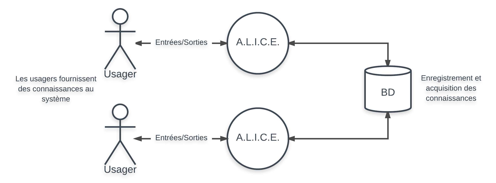
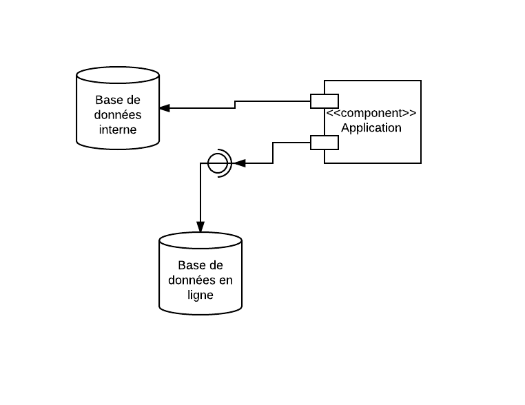
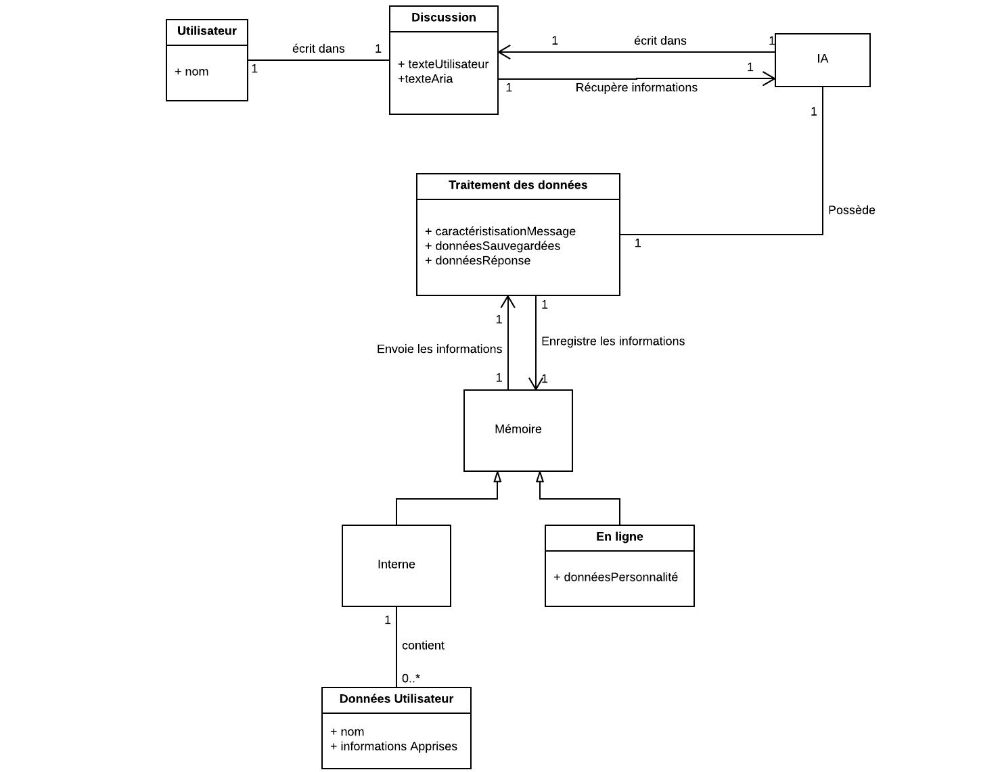
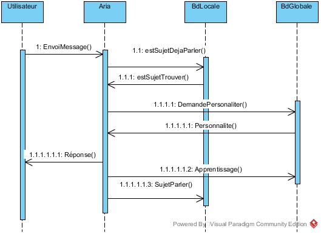
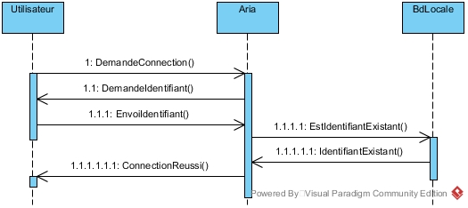
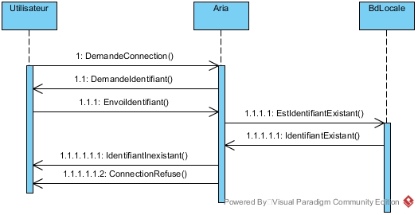
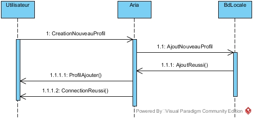

% ConOps
% Patrice Desrochers, Gildo Conte, Audrey Eugène
% 2017-09-17

# Liste des acronymes et abréviation {-}

IA
: Intelligence artificielle

ARIA
: Autonomous Reasoning Intelligent Automaton

# Historique des révisions {-}

| **Date**   | **Version** | **Description**  | **Auteur**                                                                           |
| :--------- | :---------: | :--------------- | :----------------------------------------------------------------------------------- |
| 2017-09-17 |     0.1     | Version initiale | Patrice Desrochers, Gildo Conte, Audrey Eugène |
| 2017-10-11 |     0.2     | Version Prototype | Patrice Desrochers, Gildo Conte, Audrey Eugène |

# Préface {-}

# Introduction

## Identification du système

Le système a pour nom A.R.I.A. (Autonomous Reasoning Intelligent Automaton) et il est en version 0.1.

## Objectifs du document

Communiquer les besoins et attentes des usagers du système, des développeurs ou d'un acheteur potentiel du système. Ce document s'adresse aux :

-	Usagers : Des participants actifs au développement personnel du système. Ce document tentera de décrire leurs besoins de façon fidèle.
-	Acheteurs : Pour tout acheteur potentiel, ce document permettra de mieux comprendre les besoins des usagers et le but du système.
-	Développeurs : Le document vise aussi à laisser une trace des besoins des usagers pour le développement futur de l'application.

## Vue d'ensemble du système

ARIA a pour but principal d'offrir une expérience interactive et communicative pour des usagers de tous les âges et d'intérêts variés. En plus de sa facette divertissante, le système contient aussi plusieurs buts secondaires, qui motivent son développement :

- Faire avancer les technologies associées à la problématique des intelligences artificielles
- Fournir un outil de psychologie avancé, en rendant le système communicatif et en lui permettant de développer une personnalité
- Faire participer les internautes; la personnalité et l'intelligence du système doit se développer grâce à un grand nombre d'usagers

Le développement de ce système n'est pas commandité. Il est, à sa conception, développé par Patrice Desrochers, Gildo Conte et Audrey Eugène. ARIA est une application qui fonctionnera sur n'importe quel ordinateur Windows, MacOS et Linux.

# Références

https://www.existor.com/products/cleverbot-data-for-machine-learning/

https://fr.wikipedia.org/wiki/AIML

https://en.wikipedia.org/wiki/Cleverbot

# Le système actuel

Il existe plusieurs intelligences artificielles sur le marché dont le but principal est d'imiter le dialogue avec un individu. Ces logiciels sont communément appelés « Chatterbot ». Nous prendrons ici l'exemple de Cleverbot, une IA qui a été programmée en 1988, puis mise en ligne en 1997. Cleverbot est une application web qui permet d'entretenir une conversation avec une intelligence artificielle. Celle-ci apprend à répondre en fonction des réponses de ses utilisateurs.

## Contexte, objectifs et portée du système actuel

### Portée

Cleverbot maintient une conversation en cherchant dans sa base de données les réponses qu'elle a reçues pour une question en particulier. Ainsi, elle peut reproduire le « flow » d'une conversation et apprendre des expressions ainsi que des phrases préconstruites. Cependant, Cleverbot n'est pas une entité a part entière, puisqu'elle ne fait qu'apprendre à imiter les humains avec qui elle interagit. Elle n'a pas de préférence ou d'opinion, elle n'a aucun concept du soi, et elle requiert une question pour pouvoir répondre : elle ne pose aucune question par elle-même.

## Politiques opérationnelles et contraintes

Étant donnée que Cleverbot est une application web, elle fonctionne 24 heures sur 24, 7 jours sur 7 et peut fonctionner sur n'importe quel système. Aussi, la quantité maximale de personnes connectées en simultané dépend du serveur sur lequel l'application est hébergée et non l'application elle-même.

## Description du système actuel

Les fonctionnalités du système actuel sont :

- Chatterbot
: une IA qui "comprend" et qui répond aux phrases qu'on lui dit.
- Sauvegarde de la plus récente conversation
- Réinitialisation d'une conversation pour recommencer à 0
- Possibilité de laisser l'IA choisir un sujet de conversation
- Possibilité de faire l'IA réfléchir sur le dernier sujet discuté

## Les modes d'opération du système

Un seul mode d'opération (connu) existe à l'usage de Cleverbot, soit le mode régulier, qui permet de maintenir une conversation avec l'intelligence artificielle.

## Les classes d'utilisateurs et les autres personnes impliqués

Une seule classe d'utilisateur existe à l'usage de Cleverbot, soit le locuteur, qui interagit avec l'intelligence artificielle.

### La structure organisationnelle

Les locuteurs ne sont pas en relation et ne communiquent pas entre eux. Leur seule interaction est avec l'application. Cette interaction encourage l'apprentissage de l'intelligence artificielle, qui améliore ensuite l'expérience de tous les utilisateurs.

### Le profil de chaque classe d'utilisateurs

Le locuteur est définit par une entité capable de fournir des entrées de texte à l'intelligence artificielle. La nature du locuteur est sans conséquence : celui-ci peut-être un individu en chair et en os, ou une autre intelligence artificielle, pour autant qu'il fournit une entrée de texte que Cleverbot peut lire. Le locuteur interagit avec l'application et permet à l'application d'apprendre et de mieux répondre aux prochaines entrées qui lui seront envoyées. De cette façon, le locuteur est à la fois un consommateur du service et un outil de maintenance passif, profitant du divertissement procuré en entretenant un dialogue avec l'IA, mais fournissant aussi des données qui permettront l'amélioration du service.

### Les interactions entre les utilisateurs

S/O

### Autre personnel impliqué

Étant donné la nature expérimentale de certains Chatterbots et des données qu'ils génèrent, leur amélioration et leur utilisation profite à toute la communauté des développeurs d'intelligences artificielles et recherchistes, ainsi qu'à l'avancement du domaine en général. Outre les avancées technologiques que ce type de système expérimental peut encourager, il n'influence en aucun cas le travail d'autres individus.

## L'environnement de support

Cleverbot est supporté par un serveur ainsi qu'une liaison vers internet. Il n'y a pas de logiciel de maintenance. Les seules réparations sont faites à l'interne. Les améliorations et les apprentissages du logiciel se font au fur et à mesure de ses communications avec les différents locuteurs.

# La justification et la nature des changements

## Justification des changements

Le système actuel remplit parfaitement ses tâches, mais comprend plusieurs limites qui contribuent à situer le système dans la « vallée dérangeante », soit, la zone technologique où un robot est juste assez proche de l'humain pour que ses aspects non-humains dérangent. Ces défauts empêchent Cleverbot de réellement remplir le rôle d'une intelligence artificielle; entre autres :

- Le système ne conserve aucune mémoire de la conversation et ne peut pas faire référence à un sujet précédemment discuté.
- Le système ne conserve aucune mémoire des usagers avec lesquels il a discuté.
- Le système ne se forme pas de réelle opinion sur un sujet, ne se forme aucune personnalité.
- Le système n'est pas autonome dans une conversation et doit attendre les entrées d'un utilisateur.

Le nouveau système ARIA aura pour objectif de remplir ces fonctions, afin de se rapprocher le plus possible d'une véritable intelligence artificielle. L'application sera lancée localement sur un ordinateur personnel, mais aura accès à une base de donnée en ligne, en plus d'une plus petite base de donnée locale.

## Description des changements

La nouvelle intelligence artificielle comprendra les changements suivants :

- Au niveau de l'interface, on communiquera avec ARIA non pas via un site web, mais via une application installée sur l'ordinateur personnel de l'utilisateur.
- ARIA n'attendra pas forcément de recevoir une entrée de texte de l'utilisateur avant de fournir elle-même une sortie. Ainsi, un utilisateur qui laisse l'application ouverte pourrait retrouver des messages provenant d'ARIA.
- Une application de lecture sera utilisée pour faire parler vocalement ARIA.
- ARIA comprendra une base de donnée locale qui gardera en mémoire le nom de l'utilisateur, ses préférences et les sujets discutés avec lui, basé sur les discussions entretenues avec l'IA. Les usagers devront donc choisir un profil d'utilisateur après avoir démarré l'application.
- ARIA communiquera avec une base de donnée en ligne pour se former une mémoire à long terme, accessible à partir de toutes les instances de l'application.
- L'IA se formera une opinion ou une préférence en assignant une valeur de priorité sur les mots ou groupes de mots, selon les qualitatifs qui auront été utilisés par un utilisateur pour les décrire.
- Au tout début de la vie de l'IA, des apprentissages de base lui seront conférés par les développeurs, et ce, avant que celle-ci devienne accessible à tous les utilisateurs, afin d'empêcher que les premières discussions du grand public avec ARIA soit limitées à une série d'interminables questions.

## L'ordre de priorité dans les changements

Les changements sont classés ici par ordre de priorité:

Essentiels :

- ARIA doit détenir une base de donnée en ligne, où elle préservera ses apprentissages. Sans cette base de donnée à distance, l'IA aurait une personnalité différente pour chaque utilisateur qui l'utilise sur son ordinateur personnel.
- ARIA doit assigner une préférence à des mots ou groupes de mots : c'est ce qui contribuera à lui donner une véritable identité, sans quoi, l'objectif de l'application ne sera pas atteint.
- Comme ARIA sera, dans les débuts de l'application, une intelligence avec peu de connaissance, il est primordial que les développeurs suivent son développement et lui «fournissent un apprentissage de base, comme un enfant apprend de ses géniteurs, sans quoi l'IA pourrait devenir instable ou confuse lors d'une conversation.

Souhaitables :

- Afin de rendre chaque conversation avec l'IA une expérience personnalisée, il est définitivement souhaitable que les utilisateurs soient enregistrés et reconnus lors de leurs interactions avec ARIA.
- Découlant du précédent changement souhaitable, il est primordial que l'application soit utilisée localement sur un ordinateur personnel, où se trouvera aussi la base de donnée comprenant les informations sur les usagers. Ce changement est essentiel si le précédent est implémenté. Cela évitera qu'un plus grand travail soit effectué pour gérer les données « utilisateur » et la protection des données.

Optionnels :

- ARIA n'attendra pas les entrées texte d'un utilisateur avant d'elle-même fournir une sortie texte. L'implémentation de cette fonctionnalité dépendra de la difficulté à l'implémenter. Même si cette fonction venait à manquer, elle n'empêchera pas l'IA de développer une personnalité.
- Un module qui fera la lecture vocale des sorties texte de l'IA n'est pas nécessaire au bon fonctionnement de l'application, mais lui permettra de se séparer des autres applications de ce type, et de lui donner une touche personnelle et plus humanoïde.

## Les changements considérés mais non-inclus

Des changements considérés n'ont pas été retenus, pour diverses raisons :

- ARIA devait pouvoir accéder d'elle-même à des articles sur internet et faire son apprentissage en lisant ces articles. Cette idée n'a pas été retenue pour plusieurs raison, notamment, parce que la lecture d'un article sur internet ne demande pas la même approche que celle d'un dialogue et imposerait une complexité élevée du code.
- ARIA devait au début posséder plusieurs personnalités, dépendamment de l'ordinateur personnel sur lequel elle se trouvait, et tenir ses connaissances sur une base de données locale. Cette idée a été rejetée dû à une préférence des développeurs, mais aussi dû à l'envisagement des apprentissages intensifs que doit faire l'application dans ses débuts.
- ARIA devait pouvoir générer son propre code et poser des actions sur l'ordinateur et sur internet. Étant donné l'imprévisibilité de telles décisions et la complexité du code qui devrait l'encadrer, cette idée a aussi été rejetée.

## Hypothèses et contraintes

On peut faire plusieurs hypothèses sur les obstacles que rencontreront les utilisateurs de l'application et l'application elle-même. Pour commencer, la base de données comprenant les connaissances de l'application sera vide au départ, ce qui implique que les premières discussions avec l'IA seront basées sur des questions et un apprentissage accru des nouvelles valeurs à ajouter dans la base de données. Comme l'application sera gratuite et disponible à tous, la base de donnée sera forcément accédée par un nombre élevé d'utilisateurs, avec un trafic élevé durant certaines heures de la journée. Tout cela dépend du bon fonctionnement de l'application et de sa popularité au lancement. Enfin, il faut aussi envisager que cette base de donnée sera rapidement remplie à capacité, et devra augmenter en taille pour permettre à l'intelligence artificielle de grandir.

# Le concept du système proposé

## Contexte, objectifs et portée du système proposé

Le projet ARIA a pour but de maintenir les capacités du Cleverbot tout en le rendant plus "humain". On veut que les utilisateurs aient l'impression qu'ils discutent avec un être humain et non à une entité qui répond à leurs questions. Elle doit pouvoir retenir les informations qu'elle obtient des utilisateurs et leur poser des questions pour enrichir ses connaissances et maintenir le dialogue.

## Politiques opérationnelles et contraintes

Comme ARIA est une application installée sur un ordinateur personnel, elle est toujours disponible à partir du moment où l'utilisateur l'a téléchargée. Un seul utilisateur peut interagir avec le système par session; si une autre personne souhaite discuter avec ARIA, il lui faudra attendre que le précédent utilisateur termine. Cette application sera accessible sur n'importe quel type d'ordinateur (Windows, MacOs ou Linux). On peut estimer que l'espace nécessaire au fonctionnement de l'application sera en dessous de 500 méga-octets. Une base de donnée locale contenant les informations des utilisateurs requerra davantage d'espace plus l'application sera utilisée.

\newpage

## Description du système proposé

ARIA fonctionne sur n'importe quel système qui supporte l'environnement Java Runtime. Le diagramme suivant démontre que le système est utilisable à travers une application liée à une base de données interne (pour conserver les informations des utilisateurs) et à une base de données en ligne (permettant de sauvegarder toutes les informations obtenues, et "d'améliorer" sa personnalité) :

{width=100%}
\

\newpage

Le diagramme du domaine montre comment les différentes parties de l'application interagissent entre elles :

{width=100%}
\

Le système comprend plusieurs nouvelles fonctionnalités, ainsi que des modifications sur les fonctionnalités de l'ancien système :

- Les utilisateurs doivent se connecter à ARIA, afin qu'elle puisse les reconnaître dans la base de données interne
- ARIA retient les données reçues par chaque utilisateur et enregistre de nouvelles connaissances dans une base de données en ligne
- ARIA retient les données qui concernent les utilisateurs et les enregistrent dans une base de données interne
- ARIA fait le choix d'un sujet de conversation si aucune entrée de l'utilisateur n'a été perçue pendant un certain temps
- Le temps d'attente avant qu'ARIA puisse chercher un sujet de conversation peut être allongé, raccourci, ou éliminé

L'application possède quelques contraintes quant à sa disponibilité; elle peut être démarrée à tout moment sur un ordinateur personnel, mais demande une connexion internet en tout temps. Tenir la base de données en ligne comporte aussi quelques risques quant à cette disponibilité : si la base de données ou le serveur deviennent inaccessibles, l'application devient inutilisable.

Les possibilités d'expansion sont énormes. Plusieurs fonctionnalités contribuant à rendre l'IA plus intelligente et plus autonome peuvent être ajoutées dans des mises à jour, sans pour autant nécessiter un formatage des connaissances acquises par l'IA dans ses bases de données.

Comme un Chatterbot classique, l'utilisateur participe au développement du système et à sa maintenance à chaque utilisation. Cependant, comme les données envoyées par tous les utilisateurs du système ne sont pas contrôlées et sont aléatoires, la maintenance de la base de données en ligne par un développeur peut s'avérer plus difficile, étant donnée la taille incontrôlée des connaissances d'ARIA.

Étant donné que l'application devient plus intelligente avec les usages répétés, les interactions avec celle-ci deviennent aussi plus intéressantes, augmentant la réutilisabilité de l'application.

Enfin, ARIA possède un grand niveau de portabilité, car l'application peut être installée sur divers systèmes d'opération (Windows, MacOS ou Linux).

Voici ce qu'un échange entre l'utilisateur et l'application peut entrainer comme communication entre les différentes parties de l'application

La connexion d'un utilisateur entraînera aussi différentes réponses de l'application entre ses composantes :

- Une connexion normale avec un profil déjà existant

\

- Une tentative de connexion avec un profil inexistant

\newpage

- La création d'un profil utilisateur

{width=100%}

## Les modes d'opérations du système proposé

Il ne vas y avoir qu'un seul mode d'opération lors de l'exécution de l'application. Ce mode va être le mode normal et il va permettre à l'utilisateur de communiquer avec l'IA au travers de l'interface graphique.

## Les classes d'utilisateurs et les autres personnels impliqués

### La structure organisationnelle

Les différents groupes d'usagers de l'application vont être les développeurs et les utilisateurs. Donc, dans le début, les développeurs vont être les seuls à interagir avec l'application, que ce soit en ajoutant ou modifiant des fonctionnalités, ou bien en interagissant avec l'IA pour lui apprendre des connaissances de bases. Par la suite, une fois l'application mise sur le marché, les utilisateurs normal vont pouvoir interagir avec l'IA pour entretenir une conversation. Étant donné que l'application va apprendre, il ne vas y avoir aucun groupe dédié au support de l'application, puisque les utilisateurs vont permettre à l'application de mieux répondre en fonction de ce qui lui est donné.

### Le profil de chaque classe d'utilisateurs

- Développeurs
: Les développeurs vont être ceux qui implémente les fonctionnalités du programme lors du stade de développement de celui-ci et ceux qui vont donner une intelligence basique à l'IA.

- Utilisateurs
: Les utilisateurs vont être les personnes qui communiquent avec l'IA sur leurs postes et qui vont permettre à l'IA d'apprendre et de mieux répondre.

### Les interactions entre les utilisateurs

Il ne vas pas avoir beaucoup d'interactions entre les différents utilisateurs, puisque une fois l'application mise en service, elle devrait être autonome. Les seules fois où un utilisateur aurait a communiquer avec les développeurs serait si l'utilisateur a trouver un bug majeur soit dans l'IA, soit dans l'application. À l'inverse, les seule fois où un développeur aurait a communiquer avec les utilisateurs serait lorsqu'une mise à jour est relâcher.

### Autre personnel impliqué

Aucune (a mieux formuler)

### L'environnement de support

Le code source de l'application va être héberger sur GitHub. Pour ce qui est de l'entreposage des données de la base de données en ligne, elle va être héberger sur le site de mLab qui va s'occuper de tout ce qui concerne la maintenance des serveurs.

# Les scénarios d'opération

+-------------------------+---------------------------------------------+
| Scénario 1              |       		|
+=========================+=============================================+
| Nom		              | Se connecter       |
+-------------------------+---------------------------------------------+
| Niveau                  | Objectif usager        |
+-------------------------+---------------------------------------------+
| Acteurs                 | Acteur primaire: le locuteur |
+-------------------------+---------------------------------------------+
| Préconditions           | S/O                          |
+-------------------------+---------------------------------------------+
| Postconditions          | Le locuteur est connecté     |
+-------------------------+---------------------------------------------+
| Scénario principal      | 1) Le locuteur spécifie son nom à l'IA.  |
|                         | 1) L'IA compare le nom reçu aux noms présents dans sa base de données locale. Si le nom n'est pas exactement identique à ceux présents dans la base de données, mais présente des similarités, ARIA propose un nom similaire, et demande au locuteur de confirmer son identité. |
|                         | 1) Le locuteur confirme son identité pour se connecter.      |
+-------------------------+---------------------------------------------+
| Scénario alternatif     | 1) Le locuteur spécifie son nom à l'IA.  |
|                         | 1) a) L'IA compare le nom reçu aux noms présents dans sa base de données locale. Si le nom n'est pas identique à ceux présents dans la base de données et ne présente aucune similarité, ARIA ajoute un nouveau nom dans sa base de données. |
|                         |		b) Si à l'inverse, le nom présentait des similarités, mais le locuteur ne confirme pas son identité, son nom est ajouté à la base de données. |
|                         | 3) Le locuteur est connecté.     |
+-------------------------+---------------------------------------------+
| Fréquence d'occurrence   | Une fois, au début de l'usage de l'application |
+-------------------------+---------------------------------------------+
| Commentaires & exigences | Aucun mot de passe n'est requis pour se connecter, étant donné que la base de données des utilisateurs est locale. |
+-------------------------+---------------------------------------------+

&nbsp;

+-------------------------+---------------------------------------------+
| Scénario 2              |                          |
+=========================+======================================+
| Nom                     | Dialoguer avec ARIA          |
+-------------------------+---------------------------------------------+
| Niveau                  | Objectif usager              |
+-------------------------+---------------------------------------------+
| Acteurs                 | Acteur primaire: le locuteur |
+-------------------------+---------------------------------------------+
| Préconditions           | Le locuteur est connecté     |
+-------------------------+---------------------------------------------+
| Postconditions          | ARIA envoie une réponse au locuteur |
+-------------------------+---------------------------------------------+
| Scénario principal      | 1) Le locuteur envoie une entrée texte à l'IA. |
|                         | 1) L'IA interprète la phrase et envoie une réponse en consultant ses connaissances et ses préférences sur les éléments envoyés dans l'entrée texte. |
+-------------------------+---------------------------------------------+
| Scénarios alternatifs   | 1) Le locuteur n'envoie pas une entrée texte à l'IA. |
|                         | 1) L'IA calcule un certain temps avant d'envoyer une réponse, dépendamment du dernier sujet discuté, d'un sujet présent dans sa base de donnée à distance, ou d'une préférence du locuteur. |
+-------------------------+---------------------------------------------+
| Fréquence d'occurrence   | Après la connexion du locuteur, ce scénario se répète jusqu'à la fermeture de l'application. |
+-------------------------+---------------------------------------------+
| Commentaires & exigences | Lorsqu'ARIA doit décider du sujet à discuter (dans le cas d'une absence d'entrée de texte de l'utilisateur), son choix se base sur ses propres préférences. Si une préférence du locuteur est d'une valeur similaire à une préférence de l'IA, ARIA préfèrera ce sujet de conversation. Sinon, elle préfèrera un sujet dans sa base de données avec une valeur de préférence élevée. De manière aléatoire, elle pourrait aussi favoriser la continuation d'un sujet, en particulier si ce sujet est nouveau dans sa base de données. |
+-------------------------+---------------------------------------------+

# Le sommaire des impacts

## Les impacts opérationnels

Étant donnée que le nouveau système ne se base pas sur le code de l'ancien, plusieurs gros changements seront apportés :

- La base de données globale doit être recréée, c'est-à-dire que les usagers et les développeurs devront interagir avec l'application comme si c'était un enfant (dans les débuts de l'application) pour lui permettre de se créer une intelligence de base.
- Le système passe d'une application web à une application de bureau, ce qui implique que le nouveau système devra être installé sur l'ordinateur de l'utilisateur. Il aura aussi une base de données locale.
- Pour permettre à ARIA de reconnaître les utilisateurs, le logiciel utilisera un système de noms d'utilisateur pour permettre d'avoir plusieurs utilisateurs sur le même poste et de ne pas mélanger les différentes préférences des utilisateurs.
- Chaque utilisateur aura son propre fichier de type JSON/XML qui stockera des informations sur ses préférences personnelles.
- Laisser l'application fonctionner sans interagir avec elle pendant un moment entraînera une action de l'IA, sans le besoin d'une entrée de l'utilisateur.

## Les impacts organisationnels

Le seul impact organisationnel que le nouveau système apportera est celui que plusieurs nouveaux postes de travail seront utilisés, puisque l'application devient une application de bureau et qu'elle utilise une base de données locale.

## Les impacts durant le développement

Aucun impact ne sera généré lors du développement du nouveau système, puisque c'est une équipe totalement différente qui développera le système et que le déploiement ne sera pas sur le même support.

# L'analyse du système proposé

## Le sommaire des améliorations

Les améliorations apportées au logiciel feront en sorte que l'utilisateur aura bien plus l'impression de parler avec un humain qu'avec un robot. En effet :

- Deux bases de données au lieu d'une seule.
	- Une base de données locale pour permettre à l'IA d'apprendre ce que l'utilisateur préfère ou non.
	- Une base de données globale où l'IA peut se former une mémoire a long terme.
- L'IA se développe une personnalité en attribuant des préférences à certains sujets : donc moins de réponse qui n'ont pas de sens.
- L'IA n'attendra pas toujours une entrée de l'utilisateur, elle aura la possibilité de lancer elle-même la conversation.
- La création obligatoire d'un profil utilisateur, afin que l'IA puisse récolter des données sur les préférences de l'utilisateur.

## Les inconvénients et limites

Les limites et les inconvénients de l'application sont :

- La base de données globale partira de zéro, donc un gros manque d'intelligence lors du lancement de l'application.
- Aucune manière directe pour l'utilisateur de filtrer de quoi parle l'application.
- Une connexion continue à internet est demandée pour que l'application puisse fonctionner.
- La base de données est essentielle; si elle est inaccessible, alors l'application est non-opérationnelle.

## Les alternatives et compromis considérés

Plusieurs fonctionnalités ont été considérées lors de la conception de l'application :

- ARIA devait pouvoir accéder d’elle-même à des articles sur internet et faire son apprentissage en lisant ces articles. Cette idée n’a pas été retenue parce que la lecture d’un article sur internet ne demande pas la même approche que celle d’un dialogue et imposerait une complexité élevée du code.
- ARIA devait au début posséder plusieurs personnalités, dépendamment de l’ordinateur personnel sur lequel elle se trouvait, et tenir ses connaissances sur une base de données locale. Cette idée a été rejetée dû à une préférence des développeurs, mais aussi dû à l’envisagement des apprentissages intensifs que doit faire l’application dans ses débuts.
- ARIA devait pouvoir générer son propre code et poser des actions sur l’ordinateur et sur internet. Non retenu étant donné l’imprévisibilité de telles décisions et la complexité du code qui devrait l’encadrer.

Il a fallu faire des compromis sur d'autres options comme :

- La protection des comptes utilisateurs sur la base de données locale et de leurs données par des mots de passes. Étant donné qu'un utilisateur pourrait oublier son mot de passe, cela nécessiterait un moyen de le récupérer, ce qui demandait trop de code à implémenter pour les développeurs. En effet, il faudrait crypter les fichiers sur la base de données locale et garder la clé cachée pour ne pas qu'un intrus l'utilise à mauvais escient.

# Notes

# Annexes

# Glossaire
